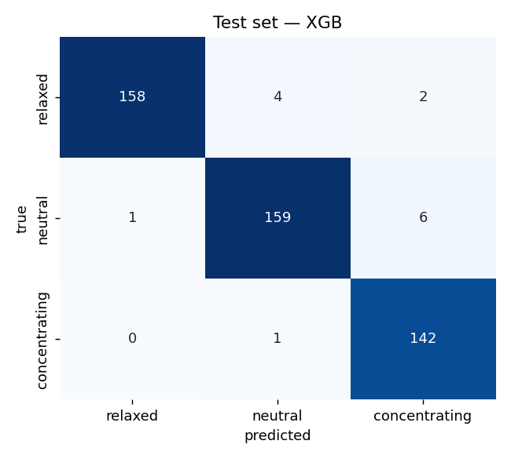

# EEG Mental State Classifier

[](https://github.com/GabeMed/eeg-mental-state-classifier/actions/workflows/ci.yml)

Three-class mental-state classification (`relaxed`, `neutral`, `concentrating`) on the Kaggle dataset [`birdy654/eeg-brainwave-dataset-mental-state`](https://www.kaggle.com/datasets/birdy654/eeg-brainwave-dataset-mental-state): 2,479 windows × 988 pre-extracted features (FFT bins, covariance, statistical moments) from a 4-electrode Muse headband (TP9, AF7, AF8, TP10), 4 subjects. The pipeline removes exact duplicates before a stratified 80/20 split, refits `RobustScaler` + ±10 clipping inside every cross-validation fold, compares a linear baseline with XGBoost, and scores a locked test set once at the end. Every finding, decision and metric is written to an append-only log (`artifacts/run_log.jsonl`), and [`REPORT.md`](REPORT.md) is built from it. A 0–100 engagement score and a Streamlit app sit on top of the trained models.

## Results

| Model | 5-fold CV macro-F1 (1,891 train rows) | Test macro-F1 (473 held-out rows) | Test accuracy |
|---|---:|---:|---:|
| Logistic Regression (L2, multinomial) | 0.9534 ± 0.0068 | **0.9528** | 0.9514 |
| XGBoost (300 trees, depth 6) | 0.9690 ± 0.0070 | **0.9704** | 0.9704 |

CV and test agree within 0.002 for both models. Per-class test F1 for XGBoost: relaxed 0.978, neutral 0.964, concentrating 0.969. Source: `artifacts/evaluation.json` and `artifacts/run_log.jsonl`.

<p align="center">
  
</p>

**Scope of these numbers.** They measure performance on unseen windows from the same 4 subjects. The Kaggle CSV has no subject or session IDs, so leave-one-subject-out validation was not possible, and adjacent windows from one session are strongly correlated. Cross-subject accuracy is expected to be lower. See [`REPORT.md` §5](REPORT.md#5-limitations--what-was-not-proven).

## Leakage controls

| Risk | Control | Enforced by |
|---|---|---|
| The same window in train and test | Exact duplicates (115 rows, 4.64%) dropped **before** the split | `src/data.py`, `tests/test_data_split.py` |
| Scaler statistics from validation rows | `RobustScaler` + clip live inside the CV `Pipeline` and are refit per fold | `src/models.py`, `tests/test_scaling_and_cv.py` |
| Scaler statistics from test rows | Final scaler fit on the training split only | `src/features.py`, `tests/test_scaling_and_cv.py` |
| Model selection on the test set | Test split is only read by `scripts/evaluate.py`, after training | `scripts/train.py` never touches it |

## Quickstart

```bash
make setup     # .venv with Python 3.12 + the pinned environment (requirements.lock)
make test      # lint + tests on synthetic data; no dataset needed
make data      # fetch the Kaggle CSV (see Data below)
make all       # train -> evaluate -> engagement figures
make app       # Streamlit app on http://localhost:8501
```

`make help` lists every target.

## Data

The dataset is not redistributed here (Kaggle terms, 62 MB). `data/mental-state.csv` is in `.gitignore`.

- **Browser:** download `mental-state.csv` from the [Kaggle dataset page](https://www.kaggle.com/datasets/birdy654/eeg-brainwave-dataset-mental-state) and save it as `data/mental-state.csv` (with a hyphen).
- **CLI:** `uv pip install kaggle`, put your own API token in `~/.kaggle/kaggle.json`, then run `make data`.

The expected file has 2,479 rows and 989 columns (988 features + `Label`, with 0 = relaxed, 1 = neutral, 2 = concentrating).

The committed artifacts in `artifacts/` let the app and the tests run without the dataset.

## Setup

`scikit-learn==1.4.2` has no wheels for Python 3.13+, so the project uses Python 3.12 (`.python-version`).

- `requirements.txt`: direct dependencies, pinned.
- `requirements-dev.txt`: adds `pytest` and `ruff`.
- `requirements.lock`: full resolution for Python 3.12 (`uv pip compile requirements-dev.txt --universal`). CI installs from this file.

Without `make`:

```bash
uv venv --python 3.12
source .venv/bin/activate
uv pip install -r requirements.lock
```

## How to run, step by step

Each step is also a `make` target (`eda`, `train`, `evaluate`, `figures`, `app`).

### a) Generate the EDA notebook

```bash
PYTHONPATH=. python scripts/build_eda_notebook.py
```

Creates or updates `notebooks/01_eda.ipynb`.

### b) Train the scaler and both models

```bash
PYTHONPATH=. python scripts/train.py
```

Produces `artifacts/{scaler.pkl, logreg.pkl, xgb.pkl, columns.json}` and logs the pipeline CV scores (scaler refit per fold) to `artifacts/run_log.jsonl`.

### c) Evaluate on the holdout + confusion matrices

```bash
PYTHONPATH=. python scripts/evaluate.py
```

Produces `artifacts/evaluation.json` and figures in `notebooks/figures/`.

### d) Generate the engagement figures

```bash
PYTHONPATH=. python scripts/plot_engagement.py
```

The engagement score is `50 * (P(concentrating) - P(relaxed) + 1)` from the logistic regression. Mean score per true class on the test set: relaxed 3.0, neutral 46.5, concentrating 99.5 (Spearman 0.93 against the class order).

### e) Launch the Streamlit app

```bash
streamlit run app/streamlit_app.py
```

Open `http://localhost:8501` and upload a CSV with the 988 feature columns (for example `data/example-mental-state.csv`). With the dataset present, **Generate sample CSV** in the sidebar writes 5 test rows to `artifacts/sample_input.csv`.

## Tests and CI

```bash
make test        # ruff + pytest (33 tests, about 20 s)
make test-fast   # skips the end-to-end run
```

The tests never need the Kaggle data. `tests/synthetic.py` builds a synthetic table with the real 988-column schema, exact duplicates and heavy-tailed outliers. The suite covers:

- **Split:** no row appears in both train and test after de-dup; a naive split on the same data does leak (so the check is meaningful); sizes, stratification and determinism.
- **Scaling and CV:** scaler statistics equal the training-fold medians in every fold and never the full-train medians; clipping at ±10; the CV pipeline mirrors production preprocessing.
- **Committed artifacts:** they load under the pinned versions, agree on the 988-column schema, classify the example rows correctly, and the recorded macro-F1 values match the stored confusion matrices.
- **End to end:** `train.py` → `evaluate.py` → `plot_engagement.py` on synthetic data in a temp directory, checking that the committed artifacts are left untouched.
- **App:** the Streamlit script starts without errors (`streamlit.testing.AppTest`).

The end-to-end test redirects all paths through environment variables, which also work by hand: `EEG_DATA_PATH`, `EEG_ARTIFACTS_DIR`, `EEG_FIGURES_DIR` (see `src/paths.py`).

GitHub Actions (`.github/workflows/ci.yml`) runs lint and the full suite on every push to `main` and every pull request.

## Repo layout

```text
eeg-mental-state-classifier/
├── .claude/                 # planning docs: DESIGN.md, PLAN.md, TASKS.md
├── .github/workflows/ci.yml
├── app/streamlit_app.py     # CSV upload -> validation -> predictions + engagement score
├── artifacts/               # committed models, scaler, column manifest, evaluation, run log
├── data/
│   ├── example-mental-state.csv   # 2 rows, committed
│   └── mental-state.csv           # Kaggle CSV, gitignored
├── notebooks/
│   ├── 01_eda.ipynb
│   └── figures/             # confusion matrices, family importance, engagement plots
├── scripts/                 # build_eda_notebook, train, evaluate, plot_engagement, render_log, ...
├── src/
│   ├── data.py              # load, de-dup, stratified split
│   ├── features.py          # RobustScaler + clip
│   ├── models.py            # estimators and pipeline CV
│   ├── engagement.py        # 0-100 engagement score
│   ├── eda.py               # EDA helpers used by the notebook
│   ├── report_log.py        # append-only decision log
│   └── paths.py             # data/artifact/figure locations (env-overridable)
├── tests/
├── Makefile
├── REPORT.md
├── pyproject.toml           # pytest + ruff config
├── requirements.txt / requirements-dev.txt / requirements.lock
└── CLAUDE.md
```

## Artifacts

- `artifacts/logreg.pkl`: Logistic Regression model trained on the scaled training set.
- `artifacts/xgb.pkl`: XGBoost model trained on the same training set.
- `artifacts/scaler.pkl`: `RobustScaler` fit on the training set (clipping is applied at use time).
- `artifacts/columns.json`: ordered catalog of the 988 columns expected by the pipeline and the app.
- `artifacts/evaluation.json`: final test metrics, confusion matrices and per-family XGBoost importance.
- `artifacts/run_log.jsonl`: append-only log of the project's metrics, decisions, and findings (58 entries).

## Context

For the technical narrative, what did not work, and limitations, read [`REPORT.md`](REPORT.md) and `.claude/PLAN.md`.
